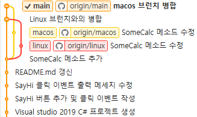
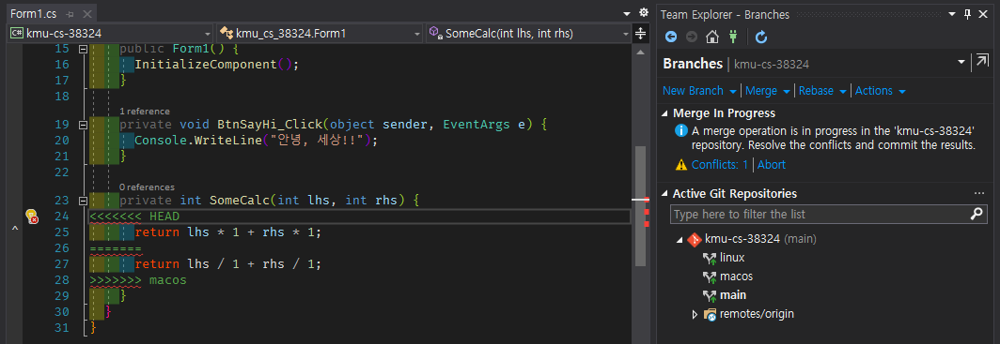
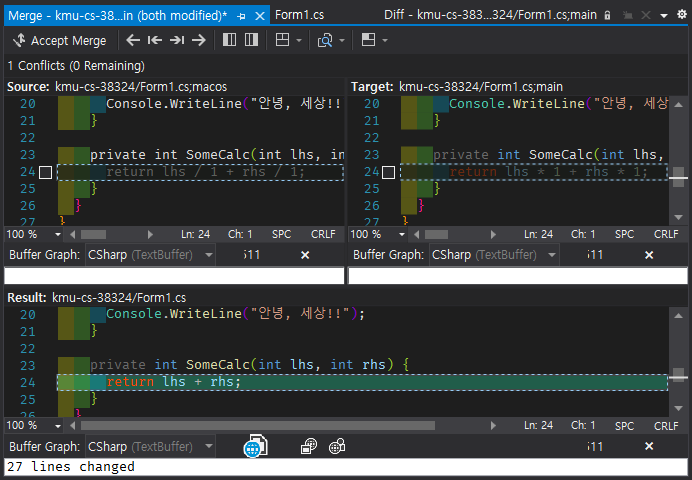

# 실감응용데이터베이스프로그래밍 과제2

> 실감응용데이터베이스 프로그래밍 수업 과제의 일환으로 작성된 레포지토리 입니다.

- 기본 과제

  - Visual studio github 연동 방법

    

    Github를 사용하기 위해선 먼저 Visual studio에 Github 확장자가 설치가 되어야합니다.

    

    Team Explorer 탭으로 이동하면 Github 아이콘과 아래 `Connect...`를 클릭해 연결합니다.

    

    `Sign in with your browser`를 클릭하면 브라우저가 뜨며 Github 로그인을 합니다. 로그인이 성공하면 자동으로 Visual studio 창에 Github가 연결됩니다.

    

    Github 정보가 나오며 `Clone | Create | Sign out`에서 선택하여 저장소를 불러오거나 생성할 수 있습니다.

  - Push 결과 화면 캡쳐

    

    프로젝트 변경사항이 생긴 경우 Visual studio에서 자동으로 감지하여 변경된 내용을 Stage에 올리고 `Commit`함으로써 작업 상태를 보관합니다. 이후 `Push`를 통해서 원격 저장소에 올려 반영합니다.

    

    모든 Commit은 History를 통해 보여주며 Local 상태와 Remote 상태를 개별적으로 확인할 수 있습니다.

    

- 추가 과제

  - Conflict 시나리오 설명

    

    ```main```으로부터 ```Linux```, ```macos```라는 2개의 브런치를 생성하며 각각 서로 다른 방식으로 SomeCalc 메소드를 수정한다. 이후 Linux, macos 브런치를 main 브런치로 병합하고 발생한 충돌을 해결한다.

  - Visual studio merge tool 사용 설명 및 캡쳐

    

    Merge를 진행하며 ```conflict(이하 충돌)```가 발생하면 Visual studio github 탭에서 사진과 같이 충돌이 발생했다는 메세지와 버튼이 발생한다. 버튼을 누르면 어떤 파일에서 무슨 행에서 충돌이 발생했는지 알려주며 ```merge 버튼```을 눌러 병합을 수행한다.

    

    Merge 버튼을 누르면 위 사진과 같은 현재 브런치에서의 코드와 충돌이 발생된 다른쪽의 소스코드가 보이며 아래는 현재 소스코드의 상태를 보여준다. 행의 왼쪽에 체크박스가 생긴다. 이 체크박스를 눌러 원하는 코드를 선택하거나 직접 수정할 수 있다. 마지막으로 상단의 ```Accept Merge```버튼을 눌러 병합된 최종 코드를 반영한다.

    이후 최종적으로 Commit후 Push를 하게 되면 무사히 원격 저장소에도 저장되게 된다.

- 느낀 점

형성 관리 도구는 팀 프로젝트에서 선택사항이 아닌 필수사항인 만큼 익숙해져야 하며 이번 과제를 통해 Git에 실습할 수 있는 주제가 생겨 매우 뿌듯합니다. 또한 개인 프로젝트인 경우 쉽게 경험하지 못하는 충돌이라는 개념을 학습하기 위한 기회여서 많은것을 배우게 되었습니다.