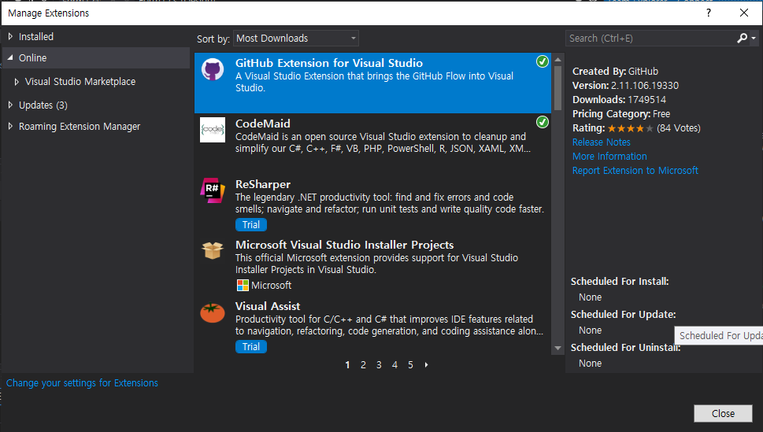
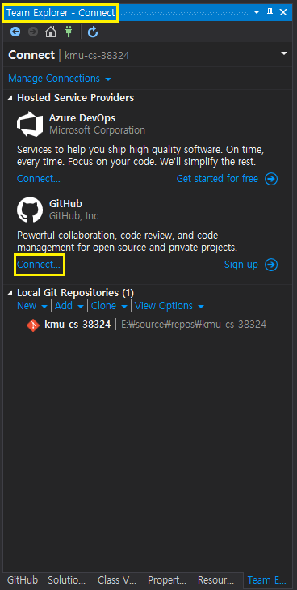
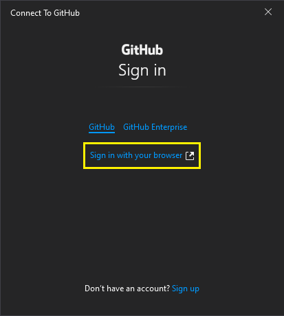
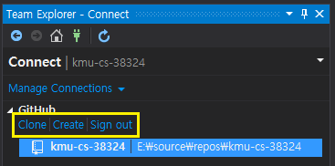
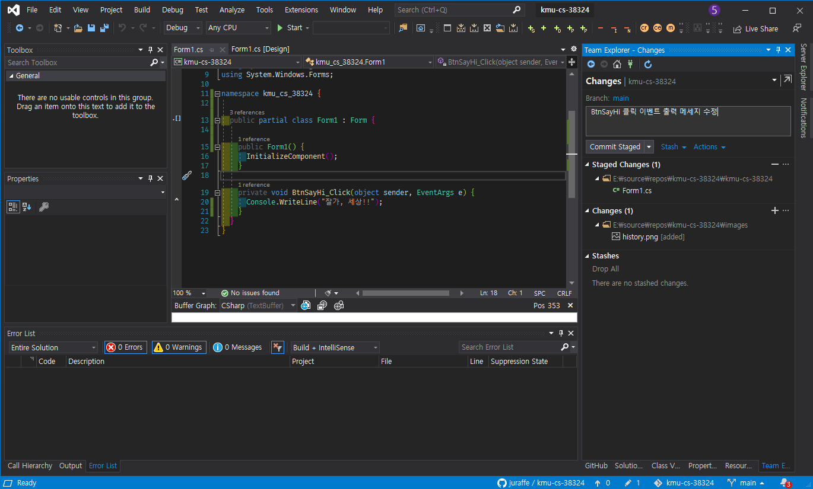
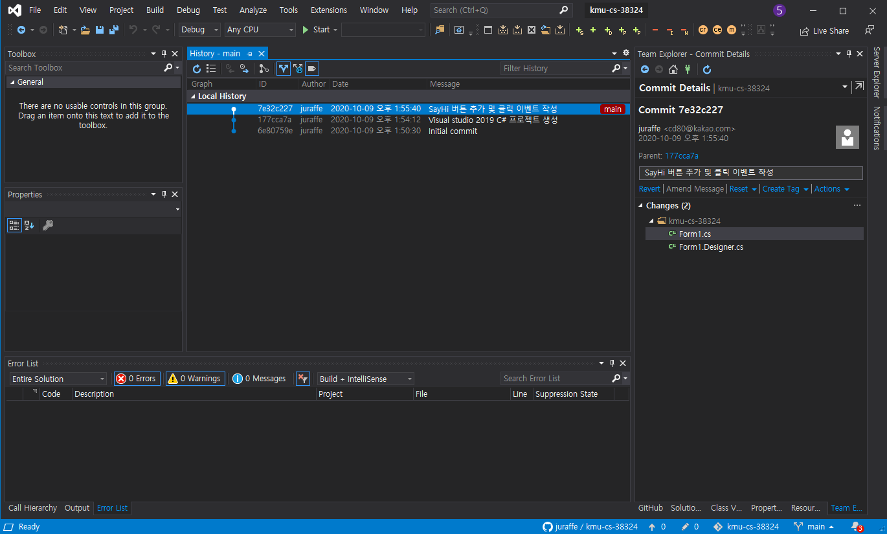
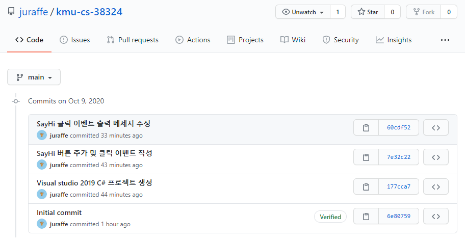

# 실감응용데이터베이스프로그래밍 과제2

> 실감응용데이터베이스 프로그래밍 수업 과제의 일환으로 작성된 레포지토리 입니다.

- 기본 과제

  - Visual studio github 연동 방법

    

    Github를 사용하기 위해선 먼저 Visual studio에 Github 확장자가 설치가 되어야합니다.

    

    Team Explorer 탭으로 이동하면 Github 아이콘과 아래 `Connect...`를 클릭해 연결합니다.

    

    `Sign in with your browser`를 클릭하면 브라우저가 뜨며 Github 로그인을 합니다. 로그인이 성공하면 자동으로 Visual studio 창에 Github가 연결됩니다.

    

    Github 정보가 나오며 `Clone | Create | Sign out`에서 선택하여 저장소를 불러오거나 생성할 수 있습니다.

  - Push 결과 화면 캡쳐

    

    프로젝트 변경사항이 생긴 경우 Visual studio에서 자동으로 감지하여 변경된 내용을 Stage에 올리고 `Commit`함으로써 작업 상태를 보관합니다. 이후 `Push`를 통해서 원격 저장소에 올려 반영합니다.

    

    모든 Commit은 History를 통해 보여주며 Local 상태와 Remote 상태를 개별적으로 확인할 수 있습니다.

    
